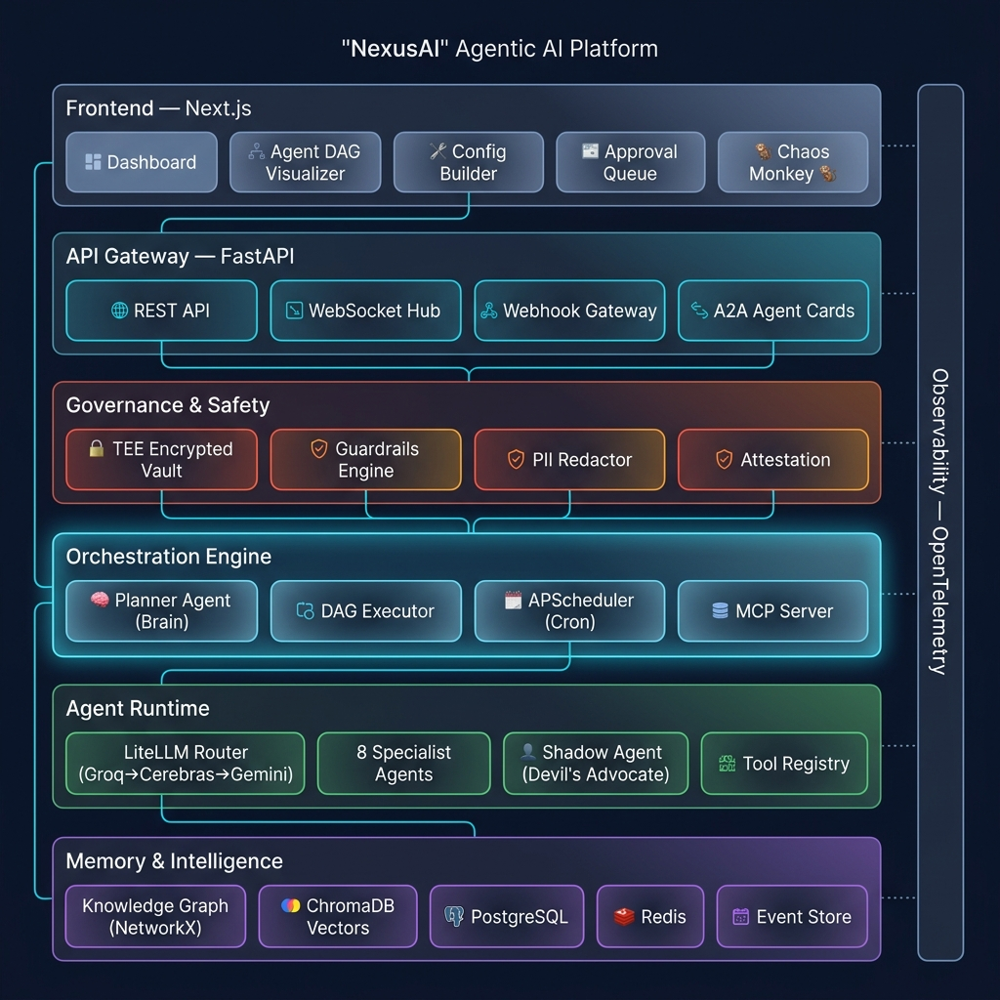

<p align="center">
  <h1 align="center">⚡ NexusAI</h1>
  <p align="center"><strong>Agentic AI Platform for B2B Customer Discovery & Prospect Intelligence</strong></p>
  <p align="center">
    <a href="#architecture">Architecture</a> •
    <a href="#quick-start">Quick Start</a> •
    <a href="#features">Features</a> •
    <a href="#tech-stack">Tech Stack</a> •
    <a href="#demo">Demo</a>
  </p>
</p>

---

## What is NexusAI?

NexusAI is a **6-layer Agentic AI platform** that autonomously discovers, qualifies, and recommends B2B prospects using a team of 8 AI agents orchestrated by a dynamic Planner. It's not a script — it's a **reusable platform** where you swap a YAML config file to change the entire business domain.

**The platform discovers leads while you sleep.** Background cron jobs monitor news and market signals. Webhook gateways react to real-time events. A Shadow Agent plays devil's advocate against every lead. And a Chaos Monkey lets you watch the system self-heal from failures.

### Business Use Case: HR SaaS Sales

> You sell HR software. NexusAI watches TechCrunch, Crunchbase, and job boards 24/7. It spots "RazorX Fintech raised $15M Series A — plans to hire 80 people." It scores them against your Ideal Customer Profile (87/100), finds the Head of People Ops (joined 3 months ago), enriches her contact info, and presents a recommendation: **"High priority lead. Managing 87 people on Google Sheets. Send personalized outreach referencing funding news."** You review, edit, and approve — AI does the grunt work, human makes the final call.

---

## Architecture



### Key Design Decisions

| Decision | Rationale |
|----------|-----------|
| **LiteLLM Router** over single provider | Triple-provider failover (Groq → Cerebras → Gemini). Never hit rate limits. |
| **NetworkX** over Neo4j | Zero infra, in-memory, full graph algorithm library. Interface is swappable. |
| **ChromaDB embedded** over Pinecone | Runs in-process, no API keys, no network latency for vector search. |
| **DAG Executor** over sequential pipeline | Parallel agent execution with dependency resolution. 3x faster pipelines. |
| **YAML business config** over hardcoded logic | Swap domain from HR SaaS to Cybersecurity in 10 minutes. |
| **Golden Path mock data** over live-only | Demo companies return pre-baked data. Demo never fails. |
| **Shadow Agent** over single validation | Devil's advocate with a separate LLM actively tries to disprove every lead. |

---

## Features

### Platform Capabilities (70% of hackathon score)

- ⚡ **Dynamic Planner Agent** — decomposes goals into DAGs, dispatches to specialist agents
- 🔀 **Async DAG Executor** — parallel execution of independent agents, dependency-aware scheduling
- 🧠 **GraphRAG** — Knowledge Graph (structural) + ChromaDB (semantic) hybrid retrieval
- 🛡️ **TEE Governance** — encrypted memory vaults, PII auto-redaction, attestation reports
- 🔌 **MCP Tool Server** — industry-standard Model Context Protocol for tool interoperability
- 🤝 **A2A Agent Cards** — agent discovery and capability advertisement via open protocol
- 🐒 **Chaos Monkey** — toggle fault injection to demo self-healing in real-time
- 👤 **Shadow Agent** — devil's advocate that challenges every high-confidence lead
- ⏰ **Background Scheduler** — APScheduler cron for autonomous discovery runs
- 🔗 **Webhook Gateway** — real-time event ingestion from external sources
- 🎯 **Human-in-the-Loop** — approval queue with edit capability before final actions
- 📊 **OpenTelemetry Observability** — full trace waterfall, token costs, quality metrics
- 🔧 **Configurable Business Rules** — YAML-driven ICP, personas, triggers, guardrails

### Specialist Agents

| Agent | Role |
|-------|------|
| 🔍 **Trigger Monitor** | Watches news, RSS, and web for funding, hiring, and leadership signals |
| 📊 **ICP Matcher** | Scores companies against multi-dimensional Ideal Customer Profile (0-100) |
| 🏢 **Company Enricher** | Validates and enriches company data from multiple sources |
| 👤 **Persona Finder** | Identifies decision-makers matching configurable persona profiles |
| 📧 **Contact Enricher** | Enriches contacts with email, phone, and LinkedIn |
| 📝 **Summary Agent** | Compiles actionable recommendation with evidence chain |
| ✅ **Validator Agent** | Quality checker — catches hallucinations and data errors |
| 👹 **Shadow Agent** | Devil's advocate — tries to disprove ICP alignment |

---

## Tech Stack

| Layer | Technology | Purpose |
|-------|-----------|---------|
| **LLM Primary** | Groq (Llama 3.x 70B) | ~500 tok/s, 30 RPM free |
| **LLM Fallback** | Cerebras (Llama 3.3 70B) | ~2000 tok/s, 1M tokens/day free |
| **LLM Tertiary** | Gemini 2.0 Flash | 15 RPM, 1M tokens/day free |
| **LLM Router** | LiteLLM | Auto-failover across providers |
| **Backend** | FastAPI + Uvicorn | Async API, WebSockets, Pydantic v2 |
| **Frontend** | React SPA (Vite) | Single Page Application, TypeScript |
| **DAG Visualization** | React Flow + Dagre | Animated agent workflow graph |
| **Knowledge Graph** | NetworkX | In-memory graph, full algorithm library |
| **Vector Store** | ChromaDB (embedded) | Semantic search, in-process |
| **Database** | PostgreSQL 16 | Persistent state, events, leads |
| **Cache** | Redis 7 | Session state, pub/sub, scratchpads |
| **Scheduler** | APScheduler | Background cron for auto-discovery |
| **HTML Parsing** | Selectolax | C-backed, 10-30x faster than BS4 |
| **HTTP Client** | httpx | Async, HTTP/2, connection pooling |
| **PII Detection** | Regex + Presidio | Fast regex first, NLP fallback |
| **Encryption** | Fernet (cryptography) | TEE vault encryption |
| **Search API** | Serper.dev | 2,500 free Google search queries |
| **News API** | NewsAPI.org | 1,000 requests/day free |
| **Scraping API** | Firecrawl | 1,000 credits/month free |

---

## Quick Start

### Prerequisites

- Python 3.11+
- Node.js 18+
- Docker & Docker Compose
- API Keys (all free tier):
  - [Groq](https://console.groq.com) — LLM primary
  - [Cerebras](https://cloud.cerebras.ai) — LLM fallback
  - [Gemini](https://aistudio.google.com) — LLM tertiary
  - [Serper](https://serper.dev) — Search API
  - [NewsAPI](https://newsapi.org) — News monitoring
  - [Firecrawl](https://firecrawl.dev) — Web scraping

### 1. Clone & Configure

```bash
git clone https://github.com/YOUR_USERNAME/nexusai.git
cd nexusai

# Copy environment template and fill in your API keys
cp .env.example .env
```

### 2. Run with Docker (Recommended)

```bash
# Start all services (backend, frontend, postgres, redis, chromadb)
docker compose up --build

# Backend: http://localhost:8000
# Frontend: http://localhost:3000
# API Docs: http://localhost:8000/docs
```

### 3. Run Locally (Development)

```bash
# Backend
cd backend
pip install -e ".[dev]"
uvicorn app.main:app --reload --port 8000

# Frontend (new terminal)
cd frontend
npm install
npm run dev
```

### 4. Try the Golden Path Demo

```bash
# Start a discovery workflow for the pre-seeded demo company
curl -X POST http://localhost:8000/api/workflows/run \
  -H "Content-Type: application/json" \
  -d '{"target_company": "RazorX", "config": "hr_saas"}'

# Or trigger via webhook
curl -X POST http://localhost:8000/v2/webhooks/crunchbase \
  -H "Content-Type: application/json" \
  -d '{"source": "crunchbase", "event_type": "funding", "company": "RazorX", "data": {"amount": "15M", "round": "Series A"}, "timestamp": "2026-06-27T00:00:00Z"}'
```

---

## Project Structure

```
nexusai/
├── README.md
├── docker-compose.yml
├── .env.example
├── Makefile
│
├── backend/
│   ├── Dockerfile
│   ├── pyproject.toml
│   ├── app/
│   │   ├── main.py                      # FastAPI entrypoint
│   │   ├── config.py                    # Pydantic settings
│   │   ├── core/                        # Platform core (reusable)
│   │   │   ├── schemas.py               # All data models
│   │   │   ├── planner.py               # Planner Agent
│   │   │   ├── dag_executor.py          # DAG task runner
│   │   │   ├── memory.py               # 3-tier shared memory
│   │   │   ├── event_store.py           # Immutable event log
│   │   │   ├── registry.py             # Agent + Tool registries
│   │   │   ├── scheduler.py            # APScheduler cron
│   │   │   ├── rate_limiter.py          # LLM rate limiting
│   │   │   └── chaos_monkey.py          # Fault injection
│   │   ├── agents/                      # 8 specialist agents
│   │   ├── tools/                       # Search, news, scraper, etc.
│   │   ├── knowledge_graph/             # NetworkX GraphRAG
│   │   ├── governance/                  # TEE, PII, guardrails
│   │   ├── protocols/                   # MCP, A2A
│   │   ├── observability/               # Tracing, metrics
│   │   ├── api/                         # REST + WebSocket routes
│   │   ├── business_config/             # YAML business rules
│   │   └── mock_data/                   # Golden path demo data
│   └── tests/
│
├── frontend/
│   ├── Dockerfile
│   ├── package.json
│   └── src/
│       ├── App.tsx                      # Main React SPA component
│       ├── components/                  # React components
│       ├── hooks/                       # WebSocket hooks
│       └── lib/                         # API client
│
└── docs/
    ├── ARCHITECTURE.md
    └── SETUP.md
```

---

## Configuring Business Rules

NexusAI is **domain-agnostic**. All business logic lives in YAML files:

### ICP (Ideal Customer Profile)
```yaml
# business_config/icp_profiles/hr_saas_icp.yaml
name: "HR SaaS ICP"
criteria:
  company_size: { min: 50, max: 500, weight: 0.25 }
  industry: { include: ["technology", "fintech"], weight: 0.20 }
  growth_stage: { include: ["series_a", "series_b"], weight: 0.20 }
  geography: { include: ["India", "USA"], weight: 0.10 }
qualification_threshold: 70
```

### Swap Domain in 10 Minutes
1. Create `business_config/icp_profiles/cybersecurity_icp.yaml`
2. Create `business_config/personas/cybersecurity_personas.yaml`
3. Create `business_config/triggers/cybersecurity_triggers.yaml`
4. Set `ACTIVE_CONFIG=cybersecurity` in `.env`
5. Restart → platform now discovers cybersecurity prospects

---

## API Endpoints

| Method | Endpoint | Description |
|--------|----------|-------------|
| `POST` | `/api/workflows/run` | Start a discovery workflow |
| `GET` | `/api/workflows/{id}` | Get workflow status + results |
| `GET` | `/api/workflows/{id}/dag` | Get execution DAG for visualization |
| `WS` | `/ws/workflow/{id}` | Real-time event stream |
| `GET` | `/api/leads` | List discovered leads |
| `GET` | `/api/approvals/pending` | Items awaiting human review |
| `POST` | `/api/approvals/{id}/approve` | Approve a recommendation |
| `POST` | `/api/approvals/{id}/reject` | Reject with feedback |
| `POST` | `/v2/webhooks/{source}` | Receive external event triggers |
| `GET` | `/api/config/icps` | List ICP profiles |
| `POST` | `/api/config/icps` | Create new ICP |
| `GET` | `/.well-known/agent-card.json` | A2A agent discovery |
| `POST` | `/api/chaos/toggle` | Enable/disable Chaos Monkey |

---

## Demo Videos

- 🎬 **[5-min Platform Demo](./docs/demo.md)** — End-to-end workflow with live agent visualization
- 🏗️ **[5-min Architecture Walkthrough](./docs/architecture.md)** — Design decisions and layer breakdown

---

## Team

Built for XL Ventures AI Hackathon 2026.


