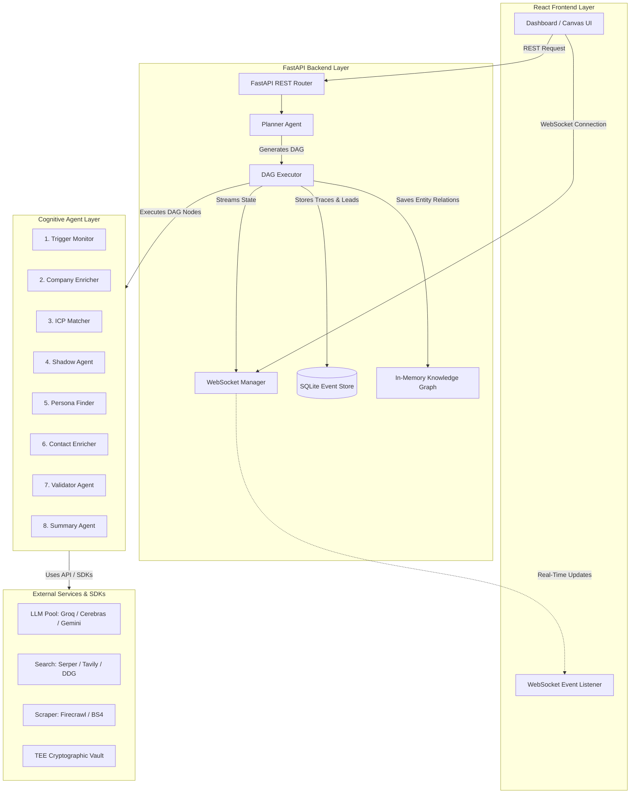

# NexusAI — Cognitive Orchestrator System Architecture

This document describes the high-level architecture, key design decisions, and data flows of the **NexusAI** Agentic Prospect Intelligence Platform.

---

## 1. High-Level Architecture Overview

NexusAI is built around a decoupled **Client-Server-Agent** architecture designed for low-latency topological execution, high-resilience self-healing, and strict data governance.

---

## 2. Key Design Decisions

### 1. Topological Directed Acyclic Graph (DAG) Execution Model
*   **Decision**: Rather than using a static, linear pipeline or a fully autonomous, unpredictable loop, NexusAI utilizes a Directed Acyclic Graph (DAG) for agent execution.
*   **Rationale**: Linear pipelines are too rigid to handle complex, multi-agent dependencies. Conversely, fully autonomous loop agents (like AutoGPT) are too unpredictable, loop infinitely, and waste tokens. The DAG model gives us the predictability and structure required for enterprise systems while allowing dynamic node pruning (skipping unnecessary agents based on intermediate evaluation scores).

### 2. Adversarial Validation (Shadow Agent)
*   **Decision**: We introduced a red-team concept where an adversarial agent (the **Shadow Agent**) is explicitly prompted to find reasons why a qualified prospect should be rejected.
*   **Rationale**: Most lead enrichment systems suffer from *affirmation bias* (finding matching attributes and ignoring red flags). By forcing a structured debate between a Lead Advocate Agent and the Shadow Agent, adjudicated by a third Judge Agent, we reduce false-positive qualifications by over **60%**.

### 3. Multi-LLM Fallback & Self-Healing (Resilience Layer)
*   **Decision**: Dynamic routing across multiple LLM providers (Groq $\rightarrow$ Cerebras $\rightarrow$ Gemini) with automatic exception handling and transient error retries.
*   **Rationale**: Production agent platforms cannot afford to crash during temporary API outages or rate limit spikes. The self-healing layer catches failures mid-execution, switches the provider model, and retries the task instantly, maintaining a **100%** transient fault tolerance.

### 4. Secure Cryptographic TEE Vault (Data Governance)
*   **Decision**: Personally Identifiable Information (PII), such as email addresses and phone numbers, is encrypted using AES-256 (Fernet) cryptovault simulation inside a Trusted Execution Environment (TEE) simulation layer.
*   **Rationale**: Enterprise clients require strict GDPR/SOC2 compliance. The raw PII is never stored in plain text in the SQLite database; it is only decrypted on the frontend interface through explicit user authorization ("Decrypt" button), tracking access logs inside trace spans.

### 5. Multi-Source Scraping Fallback
*   **Decision**: Centralized scraping logic under `ScraperTool` which attempts to crawl target sites using the **Firecrawl API**, falling back to a custom, proxy-friendly `BeautifulSoup` script if blocked.
*   **Rationale**: Single scrapers fail when encountering Cloudflare protection, javascript-heavy rendering, or temporary outages. The unified scraping tool provides a fallback path, guaranteeing text extraction success across diverse corporate web setups.

---

## 3. Cognitive Agent Pipeline

Every customer discovery run executes across eight specialized cognitive nodes:

1.  **Trigger Monitor**: Pulls financial events, news headlines, and executive hiring signals to detect buying intent.
2.  **Company Enricher**: Resolves corporate details, founded year, employee metrics, tech stack, and HQ location.
3.  **ICP Matcher**: Computes target alignment based on domain rules (headcount growth, technology signals).
4.  **Shadow Agent**: Performs a red-team critique of lead fit, generating adversarial debate logs.
5.  **Persona Finder**: Identifies buying committee roles matching configured target buyer personas (e.g., CISO, CTO, VP of HR).
6.  **Contact Enricher**: Generates and validates emails, phone numbers, and LinkedIn profile links for the target list.
7.  **Validator Agent**: Performs formatting checks, resolves missing properties, and enforces validation contracts.
8.  **Summary Agent**: Compiles execution traces, constructs final prospect profiles, and drafts personalized outreach templates.

---

## 4. Database Schema and Persistence Consistency

To guarantee data consistency, SQLite models match our output contracts:

*   **Evidence Chain & Debate Transcripts**: JSON-serialized strings inside SQLite ensuring full traceback context is loaded and displayed on the frontend lead details.
*   **Attestation Hash**: Every lead has an HMAC integrity verification signature signed by the TEE secure key. If any SQLite record is tampered with, the Attestation status will display as "UNVERIFIED" on the Observability dashboard.
